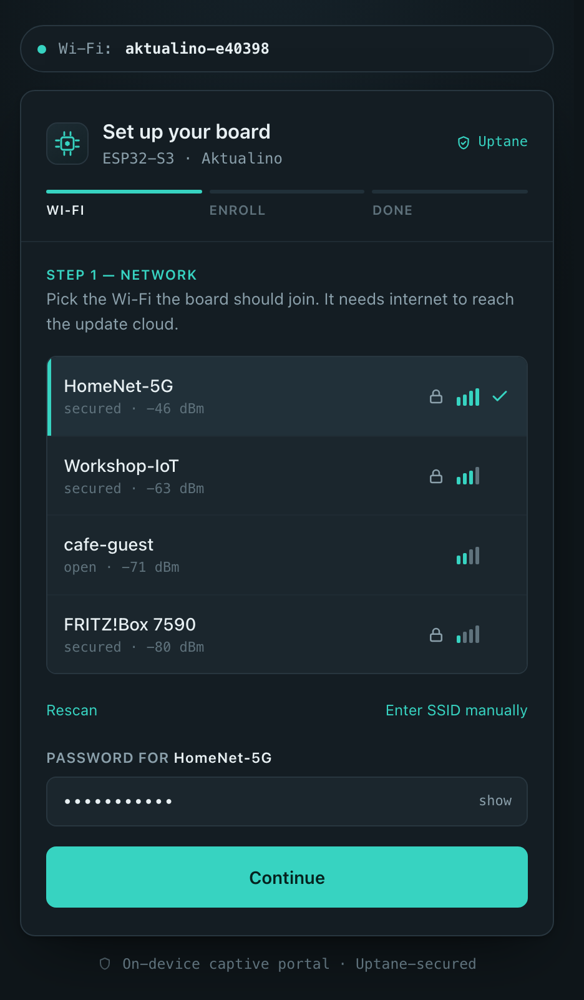
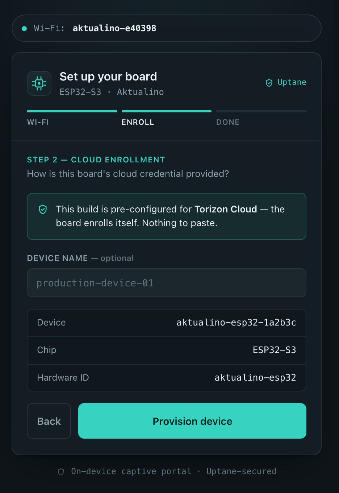
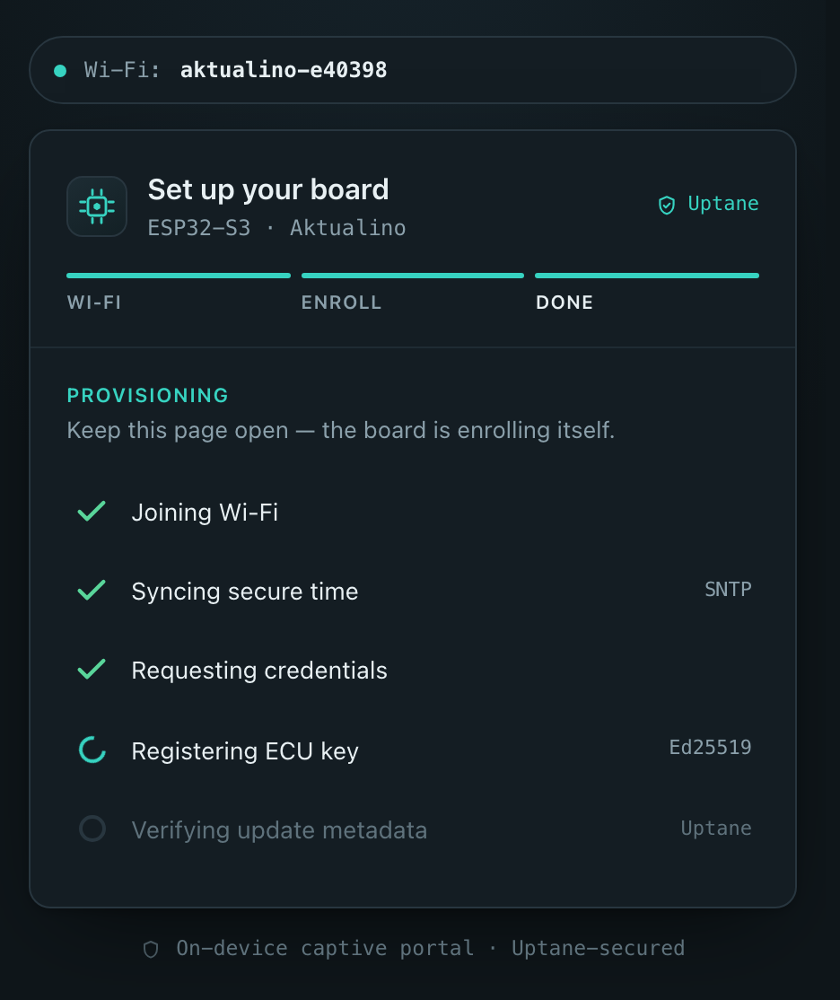
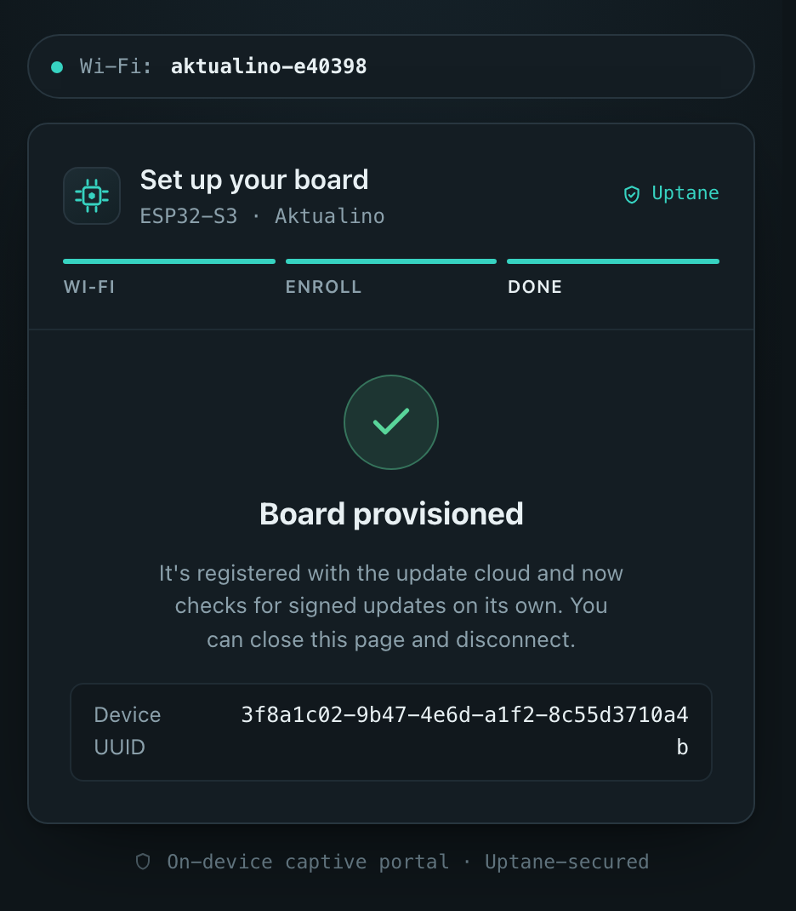

# Aktualino

**A tiny, complete two-repo Uptane/TUF OTA update client for the ESP32.**

Aktualino ("little aktualizr") is a clean, from-scratch implementation of the
Uptane/TUF *client logic* sized for a microcontroller — not a port of aktualizr
(no Boost / curl / sqlite / OSTree). It provisions an ESP32 to **Torizon Cloud**,
verifies cryptographically-signed update metadata on-device, downloads a
plain-binary firmware target over mTLS, installs it into the inactive A/B slot
using native ESP-IDF OTA, self-confirms, and reports a signed Uptane device
manifest back to the Director — rolling back automatically on failure.

It targets Toradex **Torizon Cloud** (`app.torizon.io` / `dgw.torizon.io`), which
runs the OTA-Connect/Uptane stack, and reuses ESP-IDF's native A/B (`ota_0`/
`ota_1`) OTA and bootloader rollback so the update engine stays small.

## Why it's interesting

Full Uptane on a microcontroller is usually assumed to need a Linux-class client.
Aktualino shows the whole two-repo verification — two independent trust anchors,
byte-exact canonical JSON, Ed25519 **and** RSASSA-PSS-SHA256 signature checks,
the meta-hash chain, streaming download-and-hash, and A/B install with rollback —
fits on a classic ESP32 with room to spare.

## Features

- **Full two-repo Uptane verification.** A firmware target installs **only** when
  the Director **and** the Image repo independently sign the identical
  `{filepath, sha256, length}`. A Director-only target, a cross-repo hash/length
  mismatch, an expired role, a downgraded version, or a broken metadata-hash chain
  are all refused before any flash write.
- **A/B updates with automatic rollback.** Streaming SHA-256 + length verification
  into the inactive slot; a corrupt image never boots, and an image that boots but
  fails its self-check is rolled back by the bootloader
  (`CONFIG_BOOTLOADER_APP_ROLLBACK_ENABLE` — burns no eFuses).
- **On-device provisioning to Torizon Cloud.** OAuth2 → `POST /accounts/devices`
  → `device.zip` (inflated on-chip), ECU self-registration, and a V3 signed device
  manifest — done on the device, or injected headlessly by a host tool.
- **SoftAP captive-portal setup.** A shell-less board with no Wi-Fi boots as an
  access point with a self-contained captive setup page; pick Wi-Fi (and, for a
  public binary, paste a provisioning credential) and it self-enrols.
- **ESP32 and ESP32-S3.** The security-critical core is portable C (cJSON +
  mbedTLS + libsodium) shared byte-for-byte between the host unit tests and both
  on-target builds.
- **Optional Berry script secondary.** Build with `CONFIG_AKTUALINO_SCRIPT_SECONDARY=y`
  (off by default) to deploy small **[Berry](https://github.com/berry-lang/berry)** scripts
  over the air as their own two-repo-verified Uptane target — read a pin, toggle a
  relay, small logic — without recompiling the firmware. See
  [`docs/bundles.md`](docs/bundles.md).

## Setup portal

A shell-less board with no Wi-Fi boots as its own access point (`aktualino-<mac6>`) and
serves a self-contained captive page — join it from a phone, pick Wi-Fi, and the board
enrolls itself to Torizon Cloud. No app to install, ~7 KB gzipped, works offline on the AP.

| Pick Wi-Fi | Cloud enrollment | Provisioning | Done |
|:--:|:--:|:--:|:--:|
|  |  |  |  |

<sub>Screenshots rendered from the on-device page (`components/aktualino_portal/www/portal.html`) with placeholder Wi-Fi/device data.</sub>

## Proof points

Proven end-to-end on real hardware (classic ESP32) against real Torizon Cloud:
a device provisions and appears in the console; Director **and** Image-repo
metadata verify on-device against Torizon's live RSA keys; a console/API-driven
binary update is two-repo-cross-verified, downloaded over mTLS (following the
`302 → presigned S3` redirect), A/B-installed, booted, `mark_valid`'d, and
reported back — with Torizon Cloud recording the update **Completed / OK /
success**. A forced-failure image rolls back and reports failure. The host test
suite (7 suites) exercises canonical JSON, Ed25519 and RSA-PSS verification, the
meta-hash chain, and the cross-repo refuse paths. Serial + backend captures live
under `test/evidence/`.

The **ESP32-S3** is hardware-proven too: first-silicon bring-up (8 MB PSRAM) plus
the optional Berry script secondary delivered over Torizon Cloud and recorded
**Completed** — see `docs/torizon-cloud-validation.md` and `test/evidence/esp32s3-*.log`.

The full two-repo client fits with roughly **15% free** in the app slot on a
classic ESP32 (4 MB) and **~59% free** on the ESP32-S3.

## Quickstart

Aktualino builds with ESP-IDF v5.4. Builds run in the `espressif/idf:release-v5.4`
Docker image on a build host (any machine with Docker, reachable over SSH); the
`tools/sync-build.sh` helper rsyncs your checkout there and runs `idf.py`.

### 1. Build

```bash
# point the helper at your Docker-capable build host (defaults shown):
export AKTUALINO_BUILD_HOST=<build-host>     # e.g. localhost or a LAN box
export AKTUALINO_BUILD_USER=<ssh-user>       # optional
export AKTUALINO_SSH_KEY=~/.ssh/id_ed25519   # optional
export AKTUALINO_SERIAL_PORT=/dev/ttyUSB0    # for flash/monitor

tools/sync-build.sh build            # both targets (esp32, esp32s3)
tools/sync-build.sh build esp32      # one target
tools/sync-build.sh monitor esp32    # flash + serial monitor (board attached)
```

You can also build directly with ESP-IDF if you have it installed:
`idf.py set-target esp32 build`.

### 2. Provision to Torizon Cloud

You need a Torizon Cloud `credentials.zip` (Torizon Cloud → Settings → Repository
→ Download Credentials). There are three ways to give a board its identity — see
[`docs/provisioning.md`](docs/provisioning.md):

- **Host pre-provision (recommended for a fleet):** the host registers the device
  and flashes only the per-device identity into NVS; the board never holds an
  account secret.
  ```bash
  tools/aktualino-provision.py --torizon --credentials credentials.zip   # -> NVS image -> flash
  ```
- **Baked provisioning client (one image, many boards):** bake `provision.json`;
  each board self-registers on first boot. Dev-only — the binary carries an
  account secret, so use flash encryption and never publish it.
- **Bring-your-own-credential (public binary):** the shipped binary holds no
  secrets; the operator pastes a provisioning token into the SoftAP setup portal.

Then publish a target for your hardware id and assign it — the full runbook is in
[`DEMO.md`](DEMO.md).

## Status

v0.1 — first public release. The MVP is complete and hardware-proven: full
two-repo Uptane verification, A/B updates with rollback, on-device + portal +
CLI provisioning, and a validated end-to-end update against real Torizon Cloud.
Deferred hardening (Secure Boot, flash/NVS encryption, DS-peripheral-bound keys,
anti-rollback eFuse, on-device keygen + CSR) is tracked in
[`docs/hardening-todo.md`](docs/hardening-todo.md).

## Documentation

- [`SPEC.md`](SPEC.md) — architecture + Appendix A device wire protocol.
- [`docs/provisioning.md`](docs/provisioning.md) — how a board gets its identity + Wi-Fi.
- [`docs/bundles.md`](docs/bundles.md) — write & deploy Berry script bundles (the optional script secondary).
- [`docs/berry-secondary-spec.md`](docs/berry-secondary-spec.md) — the script-secondary design + status.
- [`docs/torizon-cloud-validation.md`](docs/torizon-cloud-validation.md) — the validated Torizon Cloud flow + results.
- [`docs/engineering-notes.md`](docs/engineering-notes.md) — hard-won lessons and gotchas.
- [`docs/hardening-todo.md`](docs/hardening-todo.md) — deferred security work.
- [`DEMO.md`](DEMO.md) — reproducible build → provision → update runbook.

## License

Apache License 2.0 — see [`LICENSE`](LICENSE) and [`NOTICE`](NOTICE).
